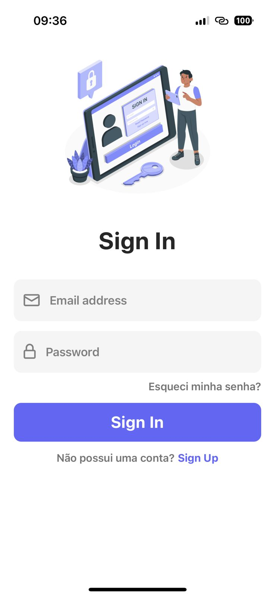
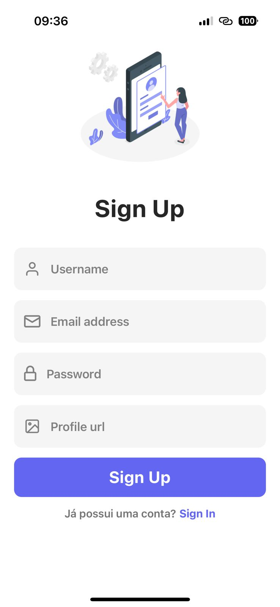

# 📱 Chat App com React Native + Firebase

Este é um aplicativo de **chat em tempo real** desenvolvido com **React Native (Expo)** e integração com **Firebase**. A aplicação permite o cadastro e login de usuários, além da troca de mensagens em tempo real entre os usuários.

---

## 🚀 Tecnologias Utilizadas

* **React Native (Expo)**
* **Firebase Authentication**
* **Firebase Firestore**
* **React Navigation**
* **Expo SDK 53** (atualizado a partir do SDK 49)

---

## 💠 Instalação e Execução

> ⚠️ Após a atualização do Expo SDK, é necessário instalar com `--force` para garantir compatibilidade.

```bash
# Clone o repositório
git clone https://github.com/seu-usuario/seu-repositorio.git
cd seu-repositorio

# Instale as dependências
npm install --force

# Inicie o projeto
npx expo start
```

> Certifique-se de ter o aplicativo **Expo Go** instalado no seu smartphone para escanear o QR code gerado e testar o app.

---

## 🔐 Configuração do Firebase

Antes de executar o app, adicione seu arquivo de configuração do Firebase:

1. Acesse o [console do Firebase](https://console.firebase.google.com/)
2. Crie um projeto
3. Ative o **Authentication** com o método **Email/Senha**
4. Crie um banco de dados **Firestore**
5. No seu projeto, crie o arquivo `firebaseConfig.js` e adicione as informações da sua conta Firebase:

```js
// firebaseConfig.js
export const firebaseConfig = {
  apiKey: "SUA_API_KEY",
  authDomain: "SEU_DOMINIO.firebaseapp.com",
  projectId: "SEU_PROJECT_ID",
  storageBucket: "SEU_BUCKET.appspot.com",
  messagingSenderId: "SEU_MESSAGING_SENDER_ID",
  appId: "SEU_APP_ID"
};
```

---

## 🖼️ Capturas de Tela

### 📲 Tela de Login



### 🆕 Tela de Cadastro



### 💬 Tela de Chat


---

## 📌 Funcionalidades

* [x] Cadastro de usuário com e-mail e senha
* [x] Autenticação via Firebase
* [x] Envio e recebimento de mensagens em tempo real
* [x] Armazenamento no Firestore
* [x] Atualização do Expo SDK para a versão 53

---
